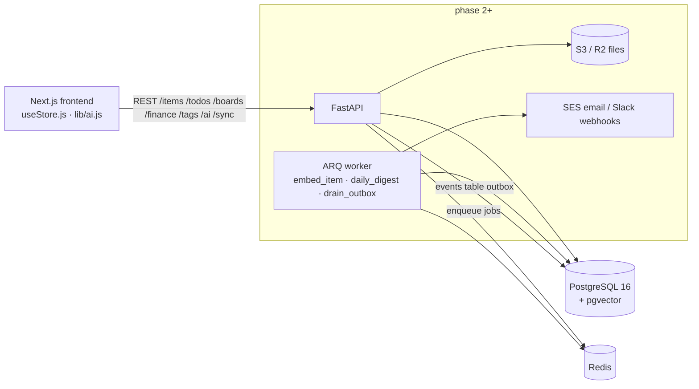
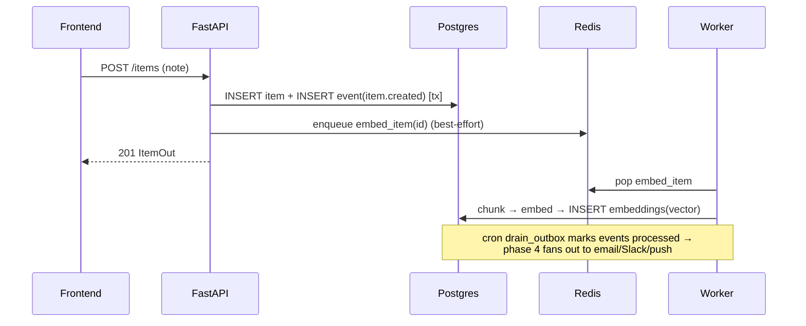

# Vault backend — system design

**Stack:** FastAPI (async) · PostgreSQL 16 + pgvector · Redis + ARQ worker · Docker → AWS (App Runner/ECS + RDS + ElastiCache + S3 + SES).

## Requirements

**Functional:** per-feature APIs mirroring the frontend's five stores; lossless import of the existing localStorage JSON export; pgvector RAG for Ask-your-Vault; event outbox for notifications/digests; per-sprint CSV; finance aggregates.

**Non-functional:** single-user today → multi-user at launch (every row carries `user_id`; auth is one dependency swap); p95 < 100ms for CRUD; AWS-portable (12-factor env config, containers, S3-API storage); zero data loss on Redis outage (DB outbox, not fire-and-forget).

**Constraints:** solo builder — boring, proven components; two frontend seams (`useStore.js`, `lib/ai.js`) must swap without UI changes.

## High-level design

**Write path with events (outbox pattern):** business write + `events` row commit in ONE transaction; the worker drains the table on a cron. Redis down ⇒ jobs delayed, never lost.

## Data model (one family per feature)

`users` · `items`(type: note|video|book|doc, JSONB blocks/links/file_meta, added_on, deleted_on) · `embeddings`(vector(768), per chunk) · `tasks` · `boards`→`sprints`/`board_columns`→`cards` · `expenses`/`bills`/`incomes`/`budgets`/`goals`/`pay_methods` · `custom_tags` · `events`(outbox).

IDs: frontend-generated string ids are kept (`client_id` on items) so the JSON export imports losslessly (`POST /sync/import` — verified round-trip).

## Trade-offs

| Decision | Chosen | Trade-off accepted |
|---|---|---|
| One `items` table vs per-type tables | one, discriminated | fewer joins & mirrors frontend; sparse columns (progress only for books) |
| JSONB blocks vs normalized block rows | JSONB | no per-block queries yet; revisit for collaborative editing |
| Outbox in Postgres vs pure Redis pub/sub | outbox | +1 write per change; buys durability |
| `create_all` bootstrap vs Alembic now | create_all in v0 | must add Alembic before first real deploy (flagged) |
| Dev hash-embedder fallback | yes | not semantic; real endpoint via `EMBEDDINGS_URL` (Ollama/OpenAI-compatible) |
| Demo-user auth seam | `X-User-Id` header | replace `current_user_id` dependency with Clerk JWT verify — single-point swap |

## Scale path

Indexes on every `user_id` + date column → RDS read replica → partition `expenses`/`events` by month → HNSW index on `embeddings.vector` once >100k chunks → shard by user only at millions of users. Worker scales horizontally (ARQ is competing-consumers).

## Verified (2026-08-18, local run)

29 endpoints up against pgvector Postgres; items/todos/boards/finance/tags CRUD exercised; **sprint completion** rolls unfinished cards to next sprint's Backlog (done cards stay archived — CSV proves it); **recurring bill pay** auto-creates next occurrence server-side; finance `/summary` aggregates in SQL; **sync import** loaded a frontend-style snapshot; **ARQ worker** consumed embed jobs from Redis; **/ai/ask** returned cosine-ranked cited sources from pgvector.
