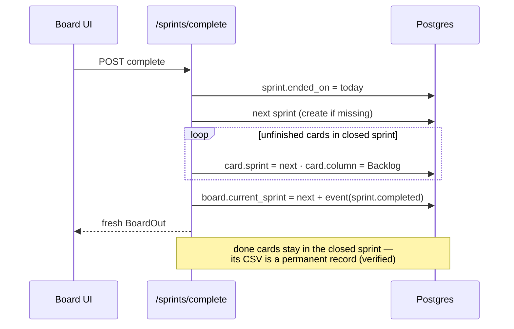

# Boards & Sprints — system design

Jira-style custom kanbans: stable task keys (`FVB-7`), labels, hours-to-complete, sprints with roll-over, per-sprint CSV.

## Data

```
boards(id, name, seq, current_sprint)
  └─ sprints(id, name, ended_on, position)
  └─ board_columns(id, title, position)
       └─ cards(id, num, text, desc, hours, labels JSONB, sprint_id, position)
```
`seq` is the per-board counter behind Jira keys — assigned once at card creation, never reused (survives moves, sprints, renames).

## API

| Endpoint | Purpose |
|---|---|
| `GET /boards` · `POST /boards` | list / create (Sprint 1 + To do/Doing/Done seeded) |
| `POST /boards/{b}/cards?column_id=` | add card (key = ++seq, joins active sprint) |
| `PUT /boards/{b}/cards/{c}?column_id=` | edit / move column / **sprint change ⇒ forced to Backlog** |
| `POST /boards/{b}/sprints/complete` | close sprint (see below) |
| `GET /boards/{b}/sprints/{s}/export.csv` | Key,Title,Status,Sprint,Labels,Hours,Description |

## Sprint completion (the product's core ritual)



## Design notes

- Rule encoded server-side (not just UI): *entering a new sprint resets a task to not-started* — the same invariant the frontend enforces, now authoritative.
- `hours` lives on the card, so per-sprint hour totals are one SUM.
- Positions are integers; fractional-rank reordering is the known upgrade when drag-precision matters via API.
