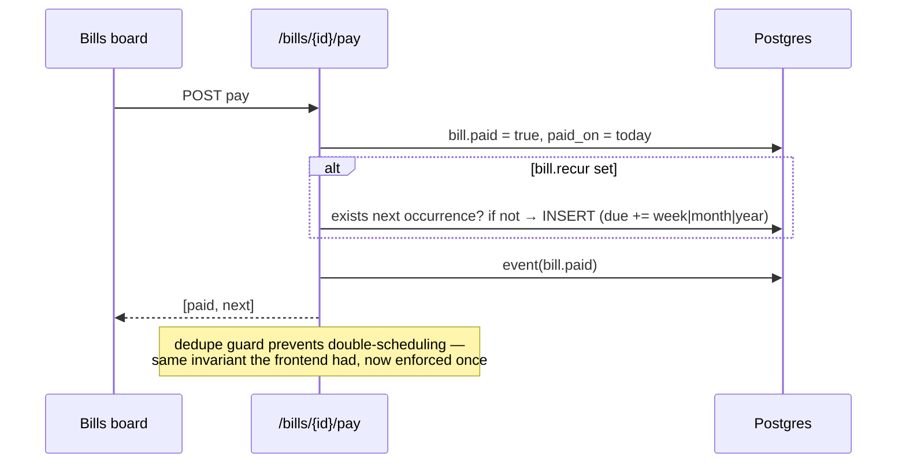

# Finance — system design

Expenses with categories & payment methods, recurring bills, income, budgets, savings goals, month summaries, CSV.

## Data

`expenses(amount, cat, pay_method_id, spent_on)` · `bills(due, paid, paid_on, recur)` · `incomes` · `budgets(scope: overall|category, cap)` · `goals(target, saved)` · `pay_methods(name, kind: credit|debit|cash|wallet|bank)`. Money as float in v0 — **flagged: switch to integer cents before real launch** (classic correctness trade-off, isolated to this feature).

## API

| Endpoint | Purpose |
|---|---|
| `GET/POST/PUT/DELETE /finance/expenses` | CRUD, `?month=YYYY-MM` filter |
| `GET/POST/DELETE /finance/bills` · `POST /finance/bills/{id}/pay` | pay returns `[paid bill, next occurrence?]` |
| `GET/POST /finance/incomes` · `/pay-methods` · `/goals` · `PUT /finance/budgets` | supporting objects |
| `GET /finance/summary?month=` | one call: spent, income, savings rate, by-category, by-pay-method, pending bills, budgets |

## Recurring bills — server-authoritative

## Summary = one SQL round trip

`SUM` + `GROUP BY cat` + `GROUP BY pay_method` + pending bills + budgets — feeds the stat tiles, both dashboards' money cards, analytics, and the printable report from a single endpoint (verified: `savings_rate: 99` on test data).

## Design notes

- Aggregations live in SQL, not application loops — the reason Postgres beat document stores for this product.
- Budget overruns become `budget.exceeded` events in phase 4 (the bell/email hook already exists in the outbox).
- Bank-statement CSV import maps onto `pay_methods` (one method = one account) when that feature lands.
