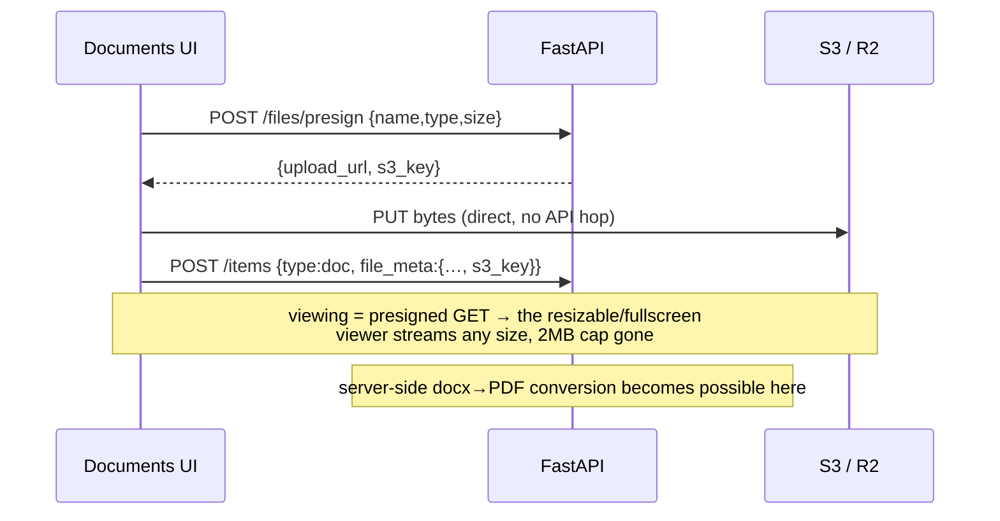

# Library · YouTube · Documents — system design

Three sections, one `items` table (`type: book | video | doc`) — they share capture, tags, trash, search and embeddings, and differ only in a few columns and rules.

## Per-type specifics

| Type | Extra fields | Rules |
|---|---|---|
| `book` | `progress` (0–100), `links[]` (attached item ids), `alias` | progress 100 ⇒ status Done; linked resources join by id |
| `video` | `url` | watched = status Done; player is a frontend concern |
| `doc` | `file_meta{name,type,size,s3_key}`, `cloud`, `url`, `blocks` | exactly one identity: **file** (uploaded), **cloud link** (gdoc/gsheet/…), or **written** (blocks) |

## Files: phase 2 (S3 presigned flow)

v0 keeps file *metadata* in Postgres while bytes stay client-side (localStorage 2MB cap). Phase 2:

## API

Shared `/items` CRUD with `?type=` filters; `PUT /items/{id}` covers progress updates (library), status flips (video queue), and cloud-link edits. `/sync/import` strips file bytes and keeps metadata (verified).

## Design notes

- The three-identity rule for documents (file/cloud/written) is enforced by which fields are set — mirrors the UI fix that gave each row exactly one primary action.
- YouTube metadata enrichment (title/duration/transcript via YouTube Data API) is a worker job in phase 4; transcripts feed the same embeddings table.
