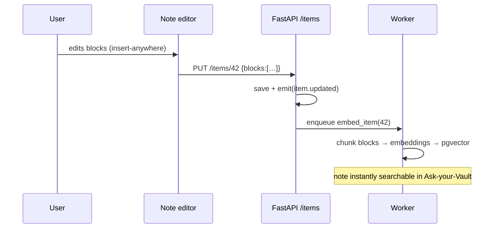

# Notes — system design

Block-based notes (headings, todos, bullets, tables, images, sub-pages) with folders, pins, tags, templates, Read/Edit views and movable date stamps.

## Data

`items` rows with `type='note'`; the editor's block tree lives in the `blocks` JSONB column — the exact shape the frontend editor produces, so no transform layer exists on either side. `folder`, `pinned`, `tags` are first-class columns for cheap filtering.

## API

| Endpoint | Purpose |
|---|---|
| `GET /items?type=note&tag=&q=` | list w/ filters (tag, substring) |
| `POST /items` | create (auto-queues embedding) |
| `PUT /items/{id}` | full update (blocks, folder, pin, stamp) |
| `DELETE /items/{id}` | soft-delete → 30-day trash |
| `POST /items/{id}/restore` · `DELETE /items/{id}/forever` | trash contract |

## Flow

## Design notes

- Blocks stay opaque JSONB until collaborative editing demands per-block rows (explicit future trade-off).
- Full-text: v0 substring; pg `tsvector` column is the planned upgrade, generated from title+blocks.
- Sub-pages are nested block arrays — depth is naturally bounded by the editor UI.
