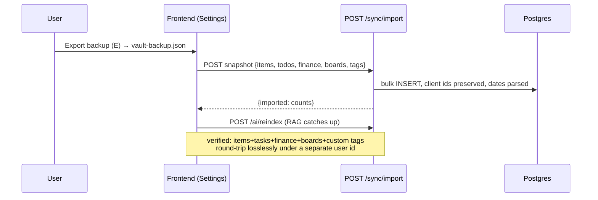
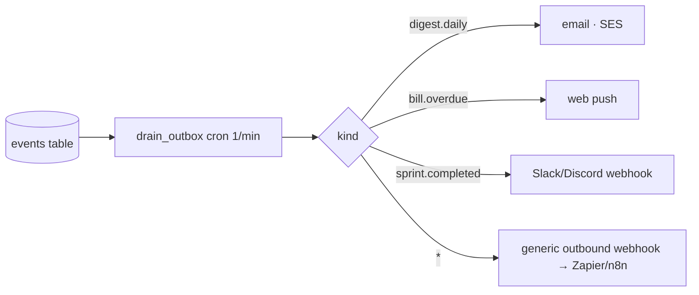

# Tags · Sync · Events — system design

## Tags

Tags live on items (`tags` JSONB) + `custom_tags` for standalone tags created in the Tags view before anything carries them.

| Endpoint | Purpose |
|---|---|
| `GET /tags` | directory: every tag with total + per-type counts; unused customs flagged `custom:true` |
| `POST /tags?tag=` | create (normalized: lowercase, dashes, `#` stripped) |
| `DELETE /tags/{tag}` | remove a custom tag (used tags live on items and are never mass-edited) |

## Sync — the migration door

The frontend's existing JSON export **is** the import format; no new exporter was needed on day one.

## Events — the outbox that powers phase 4

Every meaningful change writes an `events` row in the same transaction (`item.created`, `task.completed`, `bill.paid`, `sprint.completed`, `expense.logged`, `digest.daily`). The worker's `drain_outbox` cron marks them processed; fan-out targets plug in per `kind`:

Durability: Redis can vanish and nothing is lost — events wait in Postgres. Adding a channel = one `kind → deliverer` branch, zero feature-code changes.
