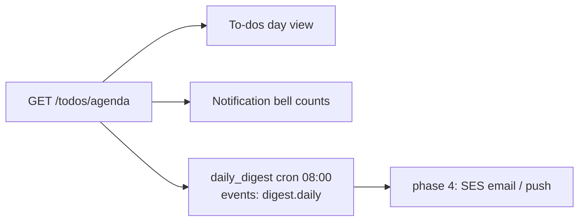

# To-dos — system design

Smart list (Overdue/Today/Upcoming/Someday), natural-language quick-add, calendar views, `.ics` both directions.

## Data

`tasks(id, text, done, done_at, due, high, label, created_on)` — flat, exactly the frontend's v2 schema. Indexes on `(user_id, due)` and `(user_id, done)` keep agenda queries instant at any size.

## API

| Endpoint | Purpose |
|---|---|
| `GET /todos` | full list |
| `GET /todos/agenda` | server-computed buckets: overdue/today/upcoming/someday |
| `POST /todos` · `PUT /todos/{id}` · `DELETE /todos/{id}` | CRUD; completing emits `task.completed` |

## Flow — one agenda feeds three surfaces

## Design notes

- Completion stamps `done_at` server-side — the "done this week" analytics and pace chart stay truthful even if a client clock is wrong.
- The worker's `daily_digest` cron writes one `digest.daily` event per user with overdue/due-today/bill counts — the outbox makes notification channels pluggable without touching this feature.
- `.ics` export/import remain client-side until phase 4 adds a subscribable per-user calendar URL (needs stable auth tokens).
