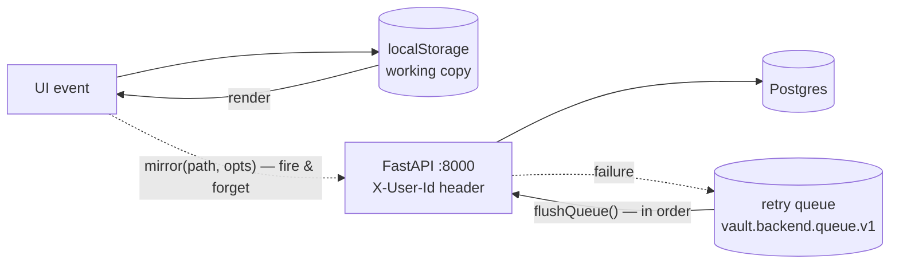

# Frontend ⇄ backend integration — the sync architecture

**Phase: write-through mirror.** localStorage is the working copy — instant,
offline-capable, and the only thing the UI ever reads. When Settings →
**☁ Backend sync** is enabled, every mutation *also* fires a mirror call to the
FastAPI backend. The app must behave identically with sync off; the backend is
a shadow, not a dependency. (System design of the backend itself:
[backend-architecture.md](backend-architecture.md).)



## The seam: `frontend/lib/api.js`

Everything flows through one small module. No component talks to `fetch`
directly.

| Export | Role |
|---|---|
| `getBackend()` / `setBackend(patch)` | config in `vault.backend.v1`: `{ url, enabled, userId, syncedAt }` (defaults `http://localhost:8000`, off, `demo`) |
| `backendOn()` | true only when enabled *and* a URL is set |
| `api(path, {method, body})` | raw JSON fetch with `X-User-Id` header; throws on non-2xx |
| `mirror(path, opts)` | **the write-through primitive** — no-op when sync is off; otherwise `api()` and, on any failure, enqueue for retry. Never throws, never blocks the UI |
| `pendingMirrors()` | queued-mirror count (for the Settings status line) |
| `flushQueue()` | replays the queue **in order**, stopping at the first failure so cross-entity ordering (create-before-update) survives; returns `{ flushed, left }` |
| `backendHealthy()` | `GET /health` → boolean |
| `fullSync()` | snapshot the five stores → `POST /sync/import` → best-effort `POST /ai/reindex` → stamp `syncedAt` |

### Retry queue semantics

- Key `vault.backend.queue.v1`, bounded to the **last 500** jobs (oldest drop first).
- A job is `{ path, opts, t }` — the exact request, replayed verbatim.
- Because every POST that mirrors a string-id entity is an **upsert**, replays
  are idempotent: flushing a queue that half-succeeded before a crash cannot
  double-insert.
- Flush triggers: the **Retry now** button in Settings; call sites may also
  flush opportunistically. There is no background timer yet (see roadmap).

## Who mirrors what (call sites)

| Store (localStorage) | Mirrored by | Endpoints |
|---|---|---|
| `vault.items.v1` | `hooks/useStore.js` | `/items` CRUD |
| `vault.todos.v1` | `components/TodoBoard.jsx` | `/todos` CRUD |
| `vault.finance.v1` | `components/FinanceBoard.jsx` | `/finance/*` |
| `vault.boards.v1` | `components/CustomBoards.jsx` | `/boards/*` |
| `vault.tags.v1` | `lib/tags.js` | `POST /tags?tag=…`, `DELETE /tags/{tag}` |
| Quick capture (todo / expense fast paths) | `components/QuickCapture.jsx` | `POST /todos`, `POST /finance/expenses` |

Quick capture routes **items** (notes, links, videos, cloud docs) through
`onAddItem` → `useStore`, so those are mirrored once by the items seam — the
capture dialog only mirrors the two writes it makes directly to localStorage
(todos and expenses). One mutation, one mirror, no double-writes.

## Canonical field mappings (frontend ⇄ backend)

Field names mostly match; where the frontend predates the schema they map as
follows (source of truth: `.claude/skills/backend-integration/SKILL.md`):

| Frontend | Backend |
|---|---|
| item `id` (Date.now number) | `client_id` (string); server has own int `id` |
| item `date` | `added_on` |
| item `deleted` | `deleted_on` |
| item `file` {name,type,size,data} | `file_meta` {name,type,size} — **bytes stay local until the S3 phase** |
| expense `pay` | `pay_method_id` |
| expense/income `date` | `spent_on` / `received_on` |
| task `doneAt` / `created` | `done_at` / `created_on` |
| bill `paidOn` | `paid_on` |
| board `current` / sprint `ended` | `current_sprint` / `ended_on` |
| card `sprint` | `sprint_id` |

**Upsert rule:** entities with frontend string ids (tasks, expenses, bills,
incomes, goals, pay methods, boards, cards) use that id as the server primary
key, and their POST endpoints are insert-or-update — so mirrors and queue
replays are idempotent. Items upsert by `client_id`. Custom tags are
upsert-safe by `(user_id, tag)` and their DELETE is idempotent.

## Auth

Two modes, set by `AUTH_MODE` on the backend.

**`dev`** — every request carries `X-User-Id` (Settings → User ID, default
`demo`) and it is trusted as sent. This is the local loop, and it is what the
frontend still speaks today. Because that header is unverifiable, the API
**refuses to start in dev mode once `CORS_ORIGINS` names a non-localhost
origin** — an unauthenticated backend cannot reach the internet by way of a
forgotten environment variable.

**`jwt`** — the request must carry `Authorization: Bearer <token>`. The
backend verifies signature, issuer, audience and expiry against the issuer's
JWKS and takes the `sub` claim as the user id. Any OIDC provider works
(Clerk, Auth0, Cognito, Supabase, Firebase); switching is three environment
variables, not a refactor.

The remaining work to go live is on the **frontend**: send the provider's
session token instead of the header in `lib/api.js`. No route, model, or
component changes — every row already carries `user_id`, and
`backend/app/auth.py` is the only place identity is resolved.

## Running it

```bash
# backend (from repo root)
cd backend
docker compose up -d db redis
.venv/bin/uvicorn app.main:app          # :8000 — compose default
# dev tip: if :8000 is busy, add  --port 8100  and point Settings at it

# frontend
cd frontend && npm run dev
```

Then in the app: avatar menu → **Settings** → **☁ BACKEND SYNC** →
check the URL (`http://localhost:8000`) and user id → **Enable sync**.

- **First enable asks the server what it holds**, because the same click
  means two opposite things. On the browser that owns the vault it means
  "upload this" → `fullSync()` pushes via `POST /sync/import` (the import
  format *is* the existing JSON export shape), rebuilds the RAG index and
  stamps `syncedAt`. On a new device it means "get my stuff" → the account
  already has data, so it **restores instead**, and the sample vault never
  overwrites the real one.
- The status lines show backend reachability (`GET /health`), last synced
  and last restored time, and the pending retry-queue count with a
  **Retry now** button.
- **Sync everything again** re-pushes the whole vault. Safe to repeat: the
  import upserts, so rows are updated in place rather than duplicated.
- **Restore this browser from the backend** pulls the vault down and replaces
  what this browser holds (armed → click again to confirm, then reload).

Spot-check from the outside:

```bash
curl -s -H 'X-User-Id: demo' http://localhost:8000/tags
docker exec backend-db-1 psql -U vault -c "select id, text from tasks where user_id='demo';"
```

## Money is integer cents

Every monetary column is `*_cents` (`INTEGER`), and the API speaks cents in
both directions. Floats drift under `SUM` — 100 mixed expenses that should
total `928.50` add up to `928.4999999999999` as floats, which is enough to
trip a budget comparison and print the wrong total. Integers cannot drift.

The browser's working copy still holds dollars because that is what the UI
edits and displays; `toCents()` / `fromCents()` in `lib/api.js` convert at
the boundary and round exactly once. `POST /sync/import` is the single
endpoint that accepts dollars, since it takes a raw localStorage dump.

## Schema is owned by Alembic

`alembic upgrade head` creates and migrates the schema; the app no longer
calls `create_all` at boot. Starting the API against an unmigrated database
raises instead of improvising a schema, so a missed migration stops a deploy
rather than silently half-working. The container runs the upgrade before
uvicorn (see `backend/Dockerfile`).

## Current limitations (deliberate, pre-launch)

- **Reads are whole-vault, not per-record merge.** A pull replaces the local
  working copy wholesale. That covers the cases that matter (new device,
  cleared browser, restore) but it is not field-level reconciliation — two
  devices editing the same note concurrently still resolve last-writer-wins
  at whole-record granularity. Real merge needs `updated_at` compared per
  record on both sides.
- **File bytes stay in the browser.** Only `file_meta` {name, type, size} is
  mirrored, so a restored document shows its details but cannot be opened —
  `pullAll()` marks those with `bodyMissing` so the UI can say so honestly.
  Upload moves to S3 pre-signed URLs in the storage phase.
- **Bill recurrence can diverge offline.** Paying a recurring bill server-side
  creates the next bill with a server-generated id; the frontend generates its
  own next-bill id when offline — the two rows won't match up until a restore
  reconciles them from the server copy.
- **Auth is configurable, and unsafe-by-default is impossible.** `AUTH_MODE=jwt`
  verifies a real OIDC token (signature, issuer, audience, expiry) against the
  provider's JWKS and takes `sub` as the user id. `AUTH_MODE=dev` still trusts
  `X-User-Id` for the local loop, but the app refuses to boot in dev mode once
  `CORS_ORIGINS` names a non-localhost origin — the frontend must send
  `Authorization: Bearer <token>` once you switch.
- **Global string primary keys.** Every entity except items keys on the
  frontend's own id, so the id space is shared across accounts. The API
  refuses any id already owned by someone else (409) rather than handing
  the row over, so this is an availability concern, not a security one —
  and `lib/id.js` now mints UUIDv4, which makes a collision practically
  impossible (the previous 7-character generator made one near-certain
  by ~1M rows). Normalizing to surrogate keys with `(user_id, client_id)`
  uniqueness, as items already does, remains the clean long-term shape.
- **No background flush.** The retry queue drains via the Settings button (or
  future call-site hooks), not on a timer or on `online` events yet.

## Upgrade path

1. **Frontend auth wiring** — the backend verifies tokens already; the
   frontend still sends `X-User-Id`. Point it at your provider's session
   token and set `AUTH_MODE=jwt`.
2. **Per-user keys** — move every string-PK table to `(user_id, client_id)`
   like items. No longer urgent now that ids are UUIDs, but it is the
   correct normalization.
3. **Per-record merge** — expose `updated_at` on the Out schemas and reconcile
   record by record instead of replacing the store, so two active devices
   converge instead of one winning.
4. **Realtime** — SSE/WebSocket fan-out of the existing `events` outbox so a
   change on one device appears on another without refresh; the retry queue
   becomes an offline outbox with server-side conflict handling.

*Status: tags + quick-capture mirroring, the Settings sync UI, and this
document are live as of 2026-08-18 (`tags-capture-sync`); the sibling skills
in `.claude/skills/` track the other seams.*
