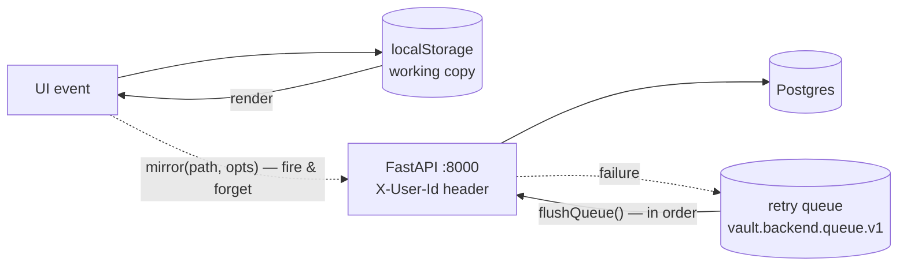

# Frontend ⇄ backend integration — the sync architecture

**Phase: write-through mirror.** localStorage is the working copy — instant,
offline-capable, and the only thing the UI ever reads. When Settings →
**☁ Backend sync** is enabled, every mutation *also* fires a mirror call to the
FastAPI backend. The app must behave identically with sync off; the backend is
a shadow, not a dependency. (System design of the backend itself:
[backend-architecture.md](backend-architecture.md).)



## The seam: `frontend/lib/api.js`

Everything flows through one small module. No component talks to `fetch`
directly.

| Export | Role |
|---|---|
| `getBackend()` / `setBackend(patch)` | config in `vault.backend.v1`: `{ url, enabled, userId, syncedAt }` (defaults `http://localhost:8000`, off, `demo`) |
| `backendOn()` | true only when enabled *and* a URL is set |
| `api(path, {method, body})` | raw JSON fetch with `X-User-Id` header; throws on non-2xx |
| `mirror(path, opts)` | **the write-through primitive** — no-op when sync is off; otherwise `api()` and, on any failure, enqueue for retry. Never throws, never blocks the UI |
| `pendingMirrors()` | queued-mirror count (for the Settings status line) |
| `flushQueue()` | replays the queue **in order**, stopping at the first failure so cross-entity ordering (create-before-update) survives; returns `{ flushed, left }` |
| `backendHealthy()` | `GET /health` → boolean |
| `fullSync()` | snapshot the five stores → `POST /sync/import` → best-effort `POST /ai/reindex` → stamp `syncedAt` |

### Retry queue semantics

- Key `vault.backend.queue.v1`, bounded to the **last 500** jobs (oldest drop first).
- A job is `{ path, opts, t }` — the exact request, replayed verbatim.
- Because every POST that mirrors a string-id entity is an **upsert**, replays
  are idempotent: flushing a queue that half-succeeded before a crash cannot
  double-insert.
- Flush triggers: the **Retry now** button in Settings; call sites may also
  flush opportunistically. There is no background timer yet (see roadmap).

## Who mirrors what (call sites)

| Store (localStorage) | Mirrored by | Endpoints |
|---|---|---|
| `vault.items.v1` | `hooks/useStore.js` | `/items` CRUD |
| `vault.todos.v1` | `components/TodoBoard.jsx` | `/todos` CRUD |
| `vault.finance.v1` | `components/FinanceBoard.jsx` | `/finance/*` |
| `vault.boards.v1` | `components/CustomBoards.jsx` | `/boards/*` |
| `vault.tags.v1` | `lib/tags.js` | `POST /tags?tag=…`, `DELETE /tags/{tag}` |
| Quick capture (todo / expense fast paths) | `components/QuickCapture.jsx` | `POST /todos`, `POST /finance/expenses` |

Quick capture routes **items** (notes, links, videos, cloud docs) through
`onAddItem` → `useStore`, so those are mirrored once by the items seam — the
capture dialog only mirrors the two writes it makes directly to localStorage
(todos and expenses). One mutation, one mirror, no double-writes.

## Canonical field mappings (frontend ⇄ backend)

Field names mostly match; where the frontend predates the schema they map as
follows (source of truth: `.claude/skills/backend-integration/SKILL.md`):

| Frontend | Backend |
|---|---|
| item `id` (Date.now number) | `client_id` (string); server has own int `id` |
| item `date` | `added_on` |
| item `deleted` | `deleted_on` |
| item `file` {name,type,size,data} | `file_meta` {name,type,size} — **bytes stay local until the S3 phase** |
| expense `pay` | `pay_method_id` |
| expense/income `date` | `spent_on` / `received_on` |
| task `doneAt` / `created` | `done_at` / `created_on` |
| bill `paidOn` | `paid_on` |
| board `current` / sprint `ended` | `current_sprint` / `ended_on` |
| card `sprint` | `sprint_id` |

**Upsert rule:** entities with frontend string ids (tasks, expenses, bills,
incomes, goals, pay methods, boards, cards) use that id as the server primary
key, and their POST endpoints are insert-or-update — so mirrors and queue
replays are idempotent. Items upsert by `client_id`. Custom tags are
upsert-safe by `(user_id, tag)` and their DELETE is idempotent.

## Auth (demo seam)

Every request carries `X-User-Id` (Settings → User ID, default `demo`). It is
a placeholder with the exact shape of the future auth: when Clerk lands, only
`backend/app/deps.py` (verify a JWT instead of trusting a header) and the
header block in `lib/api.js` change. No route, model, or component changes —
every row already carries `user_id`.

## Running it

```bash
# backend (from repo root)
cd backend
docker compose up -d db redis
.venv/bin/uvicorn app.main:app          # :8000 — compose default
# dev tip: if :8000 is busy, add  --port 8100  and point Settings at it

# frontend
cd frontend && npm run dev
```

Then in the app: avatar menu → **Settings** → **☁ BACKEND SYNC** →
check the URL (`http://localhost:8000`) and user id → **Enable sync**.

- **First enable** runs `fullSync()`: the whole local vault is pushed via
  `POST /sync/import` (the import format *is* the existing JSON export shape),
  the RAG index is rebuilt, imported counts are shown inline, and `syncedAt`
  is stamped.
- The status lines show backend reachability (`GET /health`), last synced
  time, and the pending retry-queue count with a **Retry now** button.
- **Sync everything again** re-runs the full import — read the warning below.

Spot-check from the outside:

```bash
curl -s -H 'X-User-Id: demo' http://localhost:8000/tags
docker exec backend-db-1 psql -U vault -c "select id, text from tasks where user_id='demo';"
```

## Current limitations (deliberate, pre-launch)

- **Reads never come from the server.** The UI renders localStorage only;
  the backend is write-only shadow state until the server-authoritative phase.
- **Full sync is one-shot, not reconciliation.** `/sync/import` inserts
  blindly: re-importing duplicates rows that get server-generated ids (items,
  budgets), and rows whose string ids already exist make the import fail
  wholesale (transaction rolls back, nothing written — verified 2026-08-18).
  Acceptable while the dev database is disposable; the Settings button says so.
- **File bytes stay in the browser.** Only `file_meta` {name, type, size} is
  mirrored; upload moves to S3 pre-signed URLs in the storage phase.
- **Bill recurrence can diverge offline.** Paying a recurring bill server-side
  creates the next bill with a server-generated id; the frontend generates its
  own next-bill id when offline — the two rows won't match up. Harmless
  pre-launch (reads are local); reconciliation lands with server-authoritative
  reads.
- **Header auth is trust-the-client.** `X-User-Id` is a single-user demo seam,
  not security.
- **No background flush.** The retry queue drains via the Settings button (or
  future call-site hooks), not on a timer or on `online` events yet.
- **Cross-device merge is undefined.** Two browsers mirroring to one user id
  last-write-wins per row; real multi-device sync needs the realtime phase.

## Upgrade path

1. **Clerk auth** — swap `X-User-Id` for a verified JWT in `deps.py` +
   `api.js`; enable per-user rate limits. Nothing else moves.
2. **Server-authoritative reads** — `useStore` and the feature boards hydrate
   from `GET` endpoints (localStorage demotes to cache), which unlocks real
   reconciliation, cross-device consistency, and killing `fullSync()`
   duplicates for good.
3. **Realtime** — SSE/WebSocket fan-out of the existing `events` outbox so a
   change on one device appears on another without refresh; the retry queue
   becomes an offline outbox with server-side conflict handling.

*Status: tags + quick-capture mirroring, the Settings sync UI, and this
document are live as of 2026-08-18 (`tags-capture-sync`); the sibling skills
in `.claude/skills/` track the other seams.*
